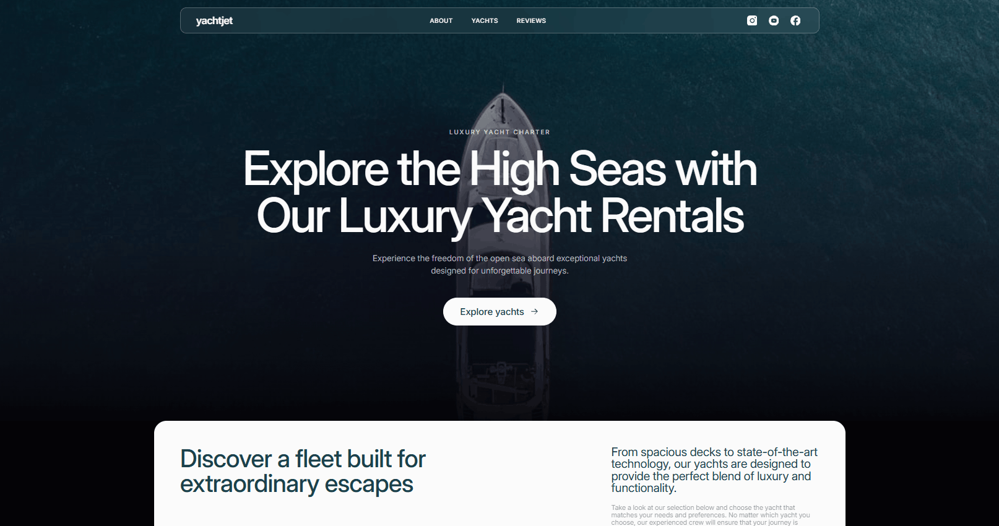
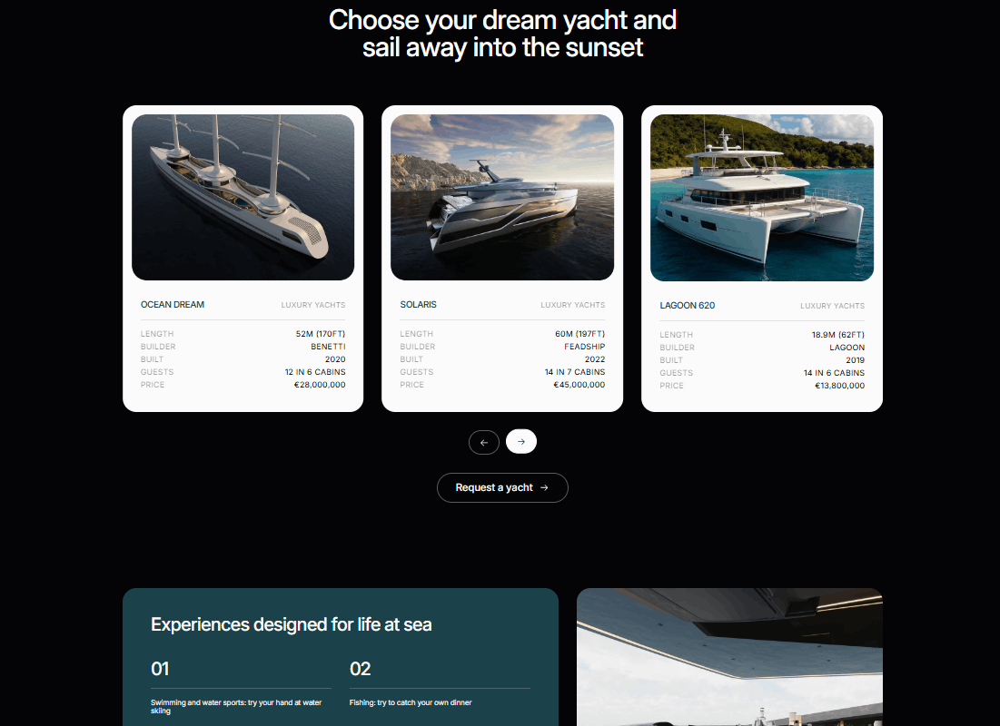
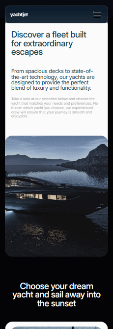

# YachtJet

A premium responsive landing page for a luxury yacht rental service, built with HTML, CSS, and vanilla JavaScript.

[Live Demo](https://serhii-taran-dev.github.io/yacht-jet-landing/)



## About the Project

YachtJet is a responsive landing page designed for a premium yacht rental service.

The project focuses on a clean luxury-inspired interface, responsive layouts, smooth interactions, and an intuitive user experience across mobile, tablet, and desktop devices.

Originally created as a learning project, it was redesigned and extended with custom styling, additional content, and JavaScript functionality to turn it into a complete portfolio project.

## Features

- Responsive mobile-first layout
- Fixed glass-style navigation header with scroll behavior
- Accessible mobile menu with focus trap and keyboard support
- Interactive yacht catalog carousel
- Responsive display of 1, 2, or 3 yacht cards depending on viewport size
- Previous and next carousel navigation
- Touch and pointer swipe support for the yacht catalog
- Reviews carousel with responsive navigation and touch gestures
- Custom client-side form validation
- Accessible form feedback and success message
- Smooth hover and focus interactions
- Responsive design optimized for mobile, tablet, and desktop screens

## Yacht Catalog

The yacht catalog provides an interactive way to explore the available fleet. The carousel adapts to different screen sizes and supports both navigation buttons and touch/pointer gestures.



## Responsive Design

YachtJet was developed using a mobile-first approach and adapts its layout, navigation, content, and interactive elements across different viewport sizes.

<p align="center">
  
</p>

## Technologies

- HTML5
- CSS3
- JavaScript (ES6+)
- Responsive Web Design
- CSS Flexbox
- CSS Grid
- Git & GitHub
- GitHub Pages

## Accessibility

The project includes several accessibility-focused improvements:

- Semantic HTML structure
- Keyboard-accessible navigation
- Focus trapping inside the mobile menu
- `Escape` key support for closing the mobile menu
- Visible `:focus-visible` states
- ARIA attributes for interactive elements
- Accessible validation messages for form fields

## Getting Started

To run the project locally:

```bash
git clone https://github.com/Serhii-Taran-dev/yacht-jet-landing.git
```

Open the project directory:

```bash
cd yacht-jet-landing
```

Then open `index.html` in your browser or run the project using a local development server such as Live Server.

## Author

**Serhii Taran**

GitHub: [Serhii-Taran-dev](https://github.com/Serhii-Taran-dev)

---

If you like this project, feel free to explore the repository and check out the live version.
